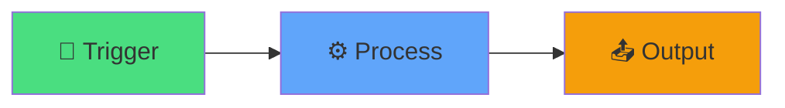
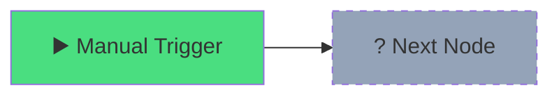
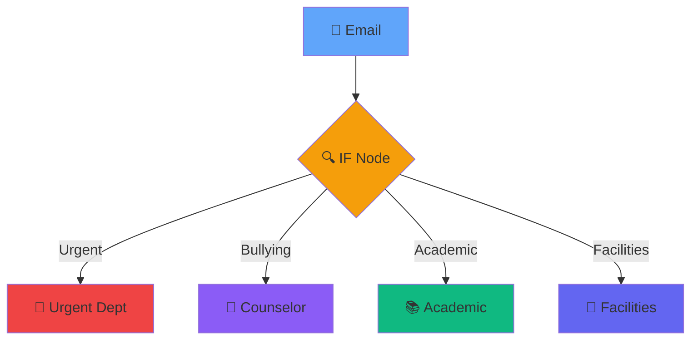

# N8N Training
## Hour 1: Foundations & First Workflow

<div class="abs-bottom mb-8 text-xl opacity-80">
  Duration: 60 minutes
</div>

---
transition: fade-out
layout: center
class: text-center
---

# Welcome! 👋

<div v-click class="text-xl mt-8">
Let's automate your school workflows
</div>

<div v-click class="mt-12 grid grid-cols-3 gap-8 text-left">
  <div class="border border-main rounded p-4">
    <div class="text-4xl mb-2">🎯</div>
    <div class="text-lg font-bold">Learn</div>
    <div class="opacity-80">Automation basics</div>
  </div>
  <div class="border border-main rounded p-4">
    <div class="text-4xl mb-2">🛠️</div>
    <div class="text-lg font-bold">Build</div>
    <div class="opacity-80">Your first workflow</div>
  </div>
  <div class="border border-main rounded p-4">
    <div class="text-4xl mb-2">🚀</div>
    <div class="text-lg font-bold">Deploy</div>
    <div class="opacity-80">Real solutions</div>
  </div>
</div>

---
transition: slide-up
---

# What is N8N? 🤔

<div class="grid grid-cols-2 gap-8 mt-8">

<div v-click>

## Workflow Automation

<div class="text-6xl my-4">⚙️</div>

Connect apps & automate tasks

</div>

<div v-click>

## No-Code Platform

<div class="text-6xl my-4">🎨</div>

Visual interface, no programming needed

</div>

</div>

<div v-click class="mt-12 p-4 bg-blue-500/20 rounded">
  <carbon:idea class="inline"/> <strong>Think of it as:</strong> A digital assistant that connects all your tools and does repetitive tasks automatically
</div>

---
transition: slide-left
---

# Why Automation in Schools? 🏫

<div class="mt-8">

<div v-click class="flex items-start gap-4 mb-6">
  <div class="text-4xl">⏱️</div>
  <div>
    <div class="text-xl font-bold">Save Time</div>
    <div class="opacity-80">Hours spent on repetitive tasks → Minutes</div>
  </div>
</div>

<div v-click class="flex items-start gap-4 mb-6">
  <div class="text-4xl">✅</div>
  <div>
    <div class="text-xl font-bold">Reduce Errors</div>
    <div class="opacity-80">Manual data entry mistakes eliminated</div>
  </div>
</div>

<div v-click class="flex items-start gap-4 mb-6">
  <div class="text-4xl">🔄</div>
  <div>
    <div class="text-xl font-bold">Consistency</div>
    <div class="opacity-80">Same process, every time</div>
  </div>
</div>

<div v-click class="flex items-start gap-4">
  <div class="text-4xl">👥</div>
  <div>
    <div class="text-xl font-bold">Focus on People</div>
    <div class="opacity-80">More time for students and staff</div>
  </div>
</div>

</div>

---
transition: fade-out
layout: two-cols
---

# N8N Interface Tour 🗺️

<div class="mt-4">

<div v-click="1" class="mb-6">
  <div class="text-2xl mb-2">📋 Canvas</div>
  <div class="opacity-80 text-sm">Your workflow workspace</div>
</div>

<div v-click="2" class="mb-6">
  <div class="text-2xl mb-2">🧩 Nodes Panel</div>
  <div class="opacity-80 text-sm">Building blocks library</div>
</div>

<div v-click="3" class="mb-6">
  <div class="text-2xl mb-2">▶️ Executions</div>
  <div class="opacity-80 text-sm">See your workflows run</div>
</div>

</div>

::right::

<div v-click="4" class="ml-8 mt-12">



<div class="mt-8 text-center opacity-80">
  Simple workflow structure
</div>

</div>

---
transition: slide-up
layout: center
class: text-center
---

# Quick Demo 🎬

<div v-click class="text-6xl my-8">
  👀
</div>

<div v-click class="text-xl opacity-80">
  See a working workflow in action
</div>

---
transition: slide-left
layout: center
class: text-center
---

# Break Time! ☕

<div class="text-6xl my-8">
  ⏸️
</div>

<div class="text-2xl">
  5 minutes
</div>

---
transition: fade-out
layout: cover
background: https://images.unsplash.com/photo-1517694712202-14dd9538aa97?q=80&w=2070
---

# Hands-on Lab 1 💻
## Your First Manual Workflow

<div class="text-xl opacity-80 mt-4">
  35 minutes
</div>

---
transition: slide-up
---

# What We'll Build 🛠️

<div class="mt-8">

<div v-click class="p-6 bg-gradient-to-r from-blue-500/20 to-purple-500/20 rounded-lg mb-6">
  <div class="text-2xl font-bold mb-4">📧 Parent Email Classifier</div>
  <div class="opacity-90">Automatically categorize and route parent emails to the right department</div>
</div>

<div class="grid grid-cols-2 gap-6 mt-8">

<div v-click>
  <div class="text-xl mb-2">📥 <strong>Input</strong></div>
  <div class="text-sm opacity-80">Parent email content</div>
</div>

<div v-click>
  <div class="text-xl mb-2">🏷️ <strong>Process</strong></div>
  <div class="text-sm opacity-80">Detect keywords & categorize</div>
</div>

<div v-click>
  <div class="text-xl mb-2">📊 <strong>Categories</strong></div>
  <div class="text-sm opacity-80">Urgent / Bullying / Academic / Facilities</div>
</div>

<div v-click>
  <div class="text-xl mb-2">🎯 <strong>Output</strong></div>
  <div class="text-sm opacity-80">Route to department heads</div>
</div>

</div>

</div>

---
transition: slide-left
---

# Step 1: Manual Trigger 🚀

<div class="grid grid-cols-2 gap-8 mt-8">

<div>

<div v-click="1">

### Create New Workflow
1. <carbon:add class="inline"/> Click "New Workflow"
2. <carbon:search class="inline"/> Find "Manual Trigger"
3. <carbon:drag class="inline"/> Drag to canvas

</div>

<div v-click="2" class="mt-8 p-4 bg-green-500/20 rounded">
  <carbon:checkmark class="inline"/> This is your starting point
</div>

</div>

<div v-click="3">



<div class="mt-4 text-sm opacity-80 text-center">
  Every workflow starts with a trigger
</div>

</div>

</div>

---
transition: fade-out
---

# Step 2: Set Node (Create Data) 📝

<div class="mt-4">

<div v-click="1" class="mb-6">

### What is a Set Node?
Creates or modifies data in your workflow

</div>

<div class="grid grid-cols-2 gap-6">

<div v-click="2">

#### Add Set Node
1. Click **+** after trigger
2. Search "Set"
3. Add these fields:
   - `email_subject`
   - `email_body`
   - `sender`

</div>

<div v-click="3">

#### Sample Data
```json
{
  "subject": "Urgent: Bullying issue",
  "body": "My child is being bullied...",
  "sender": "parent@email.com"
}
```

</div>

</div>

<div v-click="4" class="mt-6 p-4 bg-blue-500/20 rounded text-center">
  <carbon:idea class="inline"/> This simulates incoming email data
</div>

</div>

---
transition: slide-up
---

# Step 3: IF Node (Logic) 🔀

<div class="mt-4">

<div v-click="1" class="mb-4">

### Add Decision Logic
Route emails based on keywords

</div>

<div class="grid grid-cols-2 gap-6">

<div v-click="2">

#### Keywords Detection
- **Urgent**: "urgent", "emergency", "immediately"
- **Bullying**: "bully", "harassment", "hurt"
- **Academic**: "grades", "homework", "teacher"
- **Facilities**: "broken", "repair", "maintenance"

</div>

<div v-click="3">



</div>

</div>

<div v-click="4" class="mt-4 p-4 bg-yellow-500/20 rounded">
  <carbon:warning-alt class="inline"/> Use "String" → "Contains" condition
</div>

</div>

---
transition: slide-left
---

# Step 4: Test & View Results ✅

<div class="mt-8">

<div v-click="1" class="mb-8">

### Execute Your Workflow

<div class="flex items-center gap-4 mt-4">
  <div class="text-4xl">1️⃣</div>
  <div>Click the <strong>Execute Workflow</strong> button (▶️)</div>
</div>

</div>

<div v-click="2" class="grid grid-cols-2 gap-6">

<div>

#### What to Check ✓
- <carbon:checkmark-outline class="inline text-green-500"/> Green = Success
- <carbon:close-outline class="inline text-red-500"/> Red = Error
- 👁️ View data at each node
- 🔍 Check which path was taken

</div>

<div>

#### Common Issues 🐛
- Typos in keywords
- Wrong field names
- Missing connections
- Logic errors

</div>

</div>

<div v-click="3" class="mt-8 p-6 bg-green-500/20 rounded text-center text-xl">
  🎉 Congratulations! You've built your first workflow!
</div>

</div>

---
transition: fade-out
layout: center
class: text-center
---

# Practice Time! 🏃

<div v-click class="mt-8">

<div class="text-6xl mb-6">💪</div>

<div class="text-2xl mb-4">Try modifying your workflow:</div>

<div class="grid grid-cols-2 gap-4 text-left max-w-2xl mx-auto">
  <div class="p-4 border border-main rounded">✏️ Add new keywords</div>
  <div class="p-4 border border-main rounded">➕ Add new categories</div>
  <div class="p-4 border border-main rounded">🔄 Change the logic</div>
  <div class="p-4 border border-main rounded">📊 Add more data fields</div>
</div>

</div>

---
transition: slide-up
layout: two-cols
---

# Key Takeaways 🎓

<div class="mt-4">

<div v-click="1" class="mb-4">
  <div class="text-xl">✅ Workflows = Automation</div>
</div>

<div v-click="2" class="mb-4">
  <div class="text-xl">✅ Nodes = Building Blocks</div>
</div>

<div v-click="3" class="mb-4">
  <div class="text-xl">✅ Trigger → Process → Output</div>
</div>

<div v-click="4" class="mb-4">
  <div class="text-xl">✅ Test Everything</div>
</div>

</div>

::right::

<div v-click="5" class="ml-8">

## What's Next? 🔜

<div class="mt-6 space-y-4">
  <div class="p-3 bg-blue-500/20 rounded">
    Hour 2: Advanced triggers
  </div>
  <div class="p-3 bg-purple-500/20 rounded">
    Hour 3: API integrations
  </div>
  <div class="p-3 bg-green-500/20 rounded">
    Hour 4: Real workflows
  </div>
</div>

</div>

---
layout: center
class: text-center
transition: slide-left
---

# Questions? 🙋

<div class="text-6xl my-8">
  💬
</div>

<div class="text-xl opacity-80">
  Let's discuss and clarify
</div>

---
layout: end
class: text-center
transition: fade-out
---

# End of Hour 1

<div class="text-4xl my-8">
  🎉
</div>

<div class="text-xl opacity-80">
  Great job! See you in Hour 2
</div>
