# N8N Training
## Hour 1: Foundations & First Workflow

<div class="abs-bottom mb-8 text-xl opacity-80">
  Duration: 60 minutes
</div>

---
transition: fade-out
layout: center
class: text-center
---

# Welcome! <mdi-hand-wave />

<div v-click class="text-xl mt-8">
Let's automate your school workflows
</div>

<div v-click class="mt-12 grid grid-cols-3 gap-8 text-left">
  <div class="border border-main rounded p-4">
    <div class="text-4xl mb-2"><mdi-bullseye-arrow /></div>
    <div class="text-lg font-bold">Learn</div>
    <div class="opacity-80">Automation basics</div>
  </div>
  <div class="border border-main rounded p-4">
    <div class="text-4xl mb-2"><mdi-tools /></div>
    <div class="text-lg font-bold">Build</div>
    <div class="opacity-80">Your first workflow</div>
  </div>
  <div class="border border-main rounded p-4">
    <div class="text-4xl mb-2"><mdi-rocket-launch /></div>
    <div class="text-lg font-bold">Deploy</div>
    <div class="opacity-80">Real solutions</div>
  </div>
</div>

---
transition: slide-up
---

# What is N8N? <mdi-help-circle />

<div class="grid grid-cols-2 gap-8 mt-8">

<div v-click>

## Workflow Automation

<div class="text-6xl my-4"><mdi-cog /></div>

Connect apps & automate tasks

</div>

<div v-click>

## No-Code Platform

<div class="text-6xl my-4"><mdi-palette /></div>

Visual interface, no programming needed

</div>

</div>

<div v-click class="mt-12 p-4 bg-blue-500/20 rounded">
  <mdi-lightbulb-on /> <strong>Think of it as:</strong> A digital assistant that connects all your tools and does repetitive tasks automatically
</div>

---
transition: slide-left
---

# Why Automation in Schools? <mdi-school />

<div class="mt-8">

<div v-click class="flex items-start gap-4 mb-6">
  <div class="text-4xl"><mdi-timer-outline /></div>
  <div>
    <div class="text-xl font-bold">Save Time</div>
    <div class="opacity-80">Hours spent on repetitive tasks → Minutes</div>
  </div>
</div>

<div v-click class="flex items-start gap-4 mb-6">
  <div class="text-4xl"><mdi-check-circle /></div>
  <div>
    <div class="text-xl font-bold">Reduce Errors</div>
    <div class="opacity-80">Manual data entry mistakes eliminated</div>
  </div>
</div>

<div v-click class="flex items-start gap-4 mb-6">
  <div class="text-4xl"><mdi-sync /></div>
  <div>
    <div class="text-xl font-bold">Consistency</div>
    <div class="opacity-80">Same process, every time</div>
  </div>
</div>

<div v-click class="flex items-start gap-4">
  <div class="text-4xl"><mdi-account-group /></div>
  <div>
    <div class="text-xl font-bold">Focus on People</div>
    <div class="opacity-80">More time for students and staff</div>
  </div>
</div>

</div>

---
transition: fade-out
layout: two-cols
---

# N8N Interface Tour <mdi-map />

<div class="mt-4">

<div v-click="1" class="mb-6">
  <div class="text-2xl mb-2"><mdi-clipboard-text /> Canvas</div>
  <div class="opacity-80 text-sm">Your workflow workspace</div>
</div>

<div v-click="2" class="mb-6">
  <div class="text-2xl mb-2"><mdi-puzzle /> Nodes Panel</div>
  <div class="opacity-80 text-sm">Building blocks library</div>
</div>

<div v-click="3" class="mb-6">
  <div class="text-2xl mb-2"><mdi-play /> Executions</div>
  <div class="opacity-80 text-sm">See your workflows run</div>
</div>

</div>

::right::

<div v-click="4" class="ml-8 mt-12">



<div class="mt-8 text-center opacity-80">

```mermaid {scale: 0.8}
graph LR
    A[🎯 Trigger] --> B[⚙️ Process]
    B --> C[📤 Output]
    style A fill:#4ade80
    style B fill:#60a5fa
    style C fill:#f59e0b
```

  Simple workflow structure
</div>

</div>

---
transition: slide-up
layout: center
class: text-center
---

# Quick Demo <mdi-movie-open />

<div v-click class="text-6xl my-8">
  <mdi-eye />
</div>

<div v-click class="text-xl opacity-80">
  See a working workflow in action
</div>

---
transition: slide-left
layout: center
class: text-center
---

# Break Time! <mdi-coffee />

<div class="text-6xl my-8">
  <mdi-pause />
</div>

<div class="text-2xl">
  5 minutes
</div>

---
transition: fade-out
layout: cover
background: https://images.unsplash.com/photo-1517694712202-14dd9538aa97?q=80&w=2070
---

# Hands-on Lab 1 <mdi-laptop />
## Your First Manual Workflow

<div class="text-xl opacity-80 mt-4">
  35 minutes
</div>

---
transition: slide-up
---

# What We'll Build <mdi-tools />

<div class="mt-8">

<div v-click class="p-6 bg-gradient-to-r from-blue-500/20 to-purple-500/20 rounded-lg mb-6">
  <div class="text-2xl font-bold mb-4"><mdi-email /> Parent Email Classifier</div>
  <div class="opacity-90">Automatically categorize and route parent emails to the right department</div>
</div>

<div class="grid grid-cols-2 gap-6 mt-8">

<div v-click>
  <div class="text-xl mb-2"><mdi-tray-arrow-down /> <strong>Input</strong></div>
  <div class="text-sm opacity-80">Parent email content</div>
</div>

<div v-click>
  <div class="text-xl mb-2"><mdi-tag /> <strong>Process</strong></div>
  <div class="text-sm opacity-80">Detect keywords & categorize</div>
</div>

<div v-click>
  <div class="text-xl mb-2"><mdi-chart-bar /> <strong>Categories</strong></div>
  <div class="text-sm opacity-80">Urgent / Bullying / Academic / Facilities</div>
</div>

<div v-click>
  <div class="text-xl mb-2"><mdi-bullseye-arrow /> <strong>Output</strong></div>
  <div class="text-sm opacity-80">Route to department heads</div>
</div>

</div>

</div>

---
transition: slide-left
---

# Step 1: Manual Trigger <mdi-rocket-launch />

<div class="grid grid-cols-2 gap-8 mt-8">

<div>

<div v-click="1">

### Create New Workflow
1. <mdi-plus /> Click "New Workflow"
2. <mdi-magnify /> Find "Manual Trigger"
3. <mdi-drag /> Drag to canvas

</div>

<div v-click="2" class="mt-8 p-4 bg-green-500/20 rounded">
  <mdi-check /> This is your starting point
</div>

</div>

<div v-click="3">



<div class="mt-4 text-sm opacity-80 text-center">

```mermaid {scale: 0.9}
graph LR
    A[▶️ Manual Trigger] --> B[? Next Node]
    style A fill:#4ade80
    style B fill:#94a3b8,stroke-dasharray: 5 5
```

  Every workflow starts with a trigger
</div>

</div>

</div>

---
transition: fade-out
---

# Step 2: Set Node (Create Data) <mdi-pencil />

<div class="mt-4">

<div v-click="1" class="mb-6">

### What is a Set Node?
Creates or modifies data in your workflow

</div>

<div class="grid grid-cols-2 gap-6">

<div v-click="2">

#### Add Set Node
1. Click **+** after trigger
2. Search "Set"
3. Add these fields:
   - `email_subject`
   - `email_body`
   - `sender`

</div>

<div v-click="3">

#### Sample Data
```json
{
  "subject": "Urgent: Bullying issue",
  "body": "My child is being bullied...",
  "sender": "parent@email.com"
}
```

</div>

</div>

<div v-click="4" class="mt-6 p-4 bg-blue-500/20 rounded text-center">
  <mdi-lightbulb-on /> This simulates incoming email data
</div>

</div>

---
transition: slide-up
---

# Step 3: IF Node (Logic) <mdi-call-split />

<div class="mt-4">

<div v-click="1" class="mb-4">

### Add Decision Logic
Route emails based on keywords

</div>

<div class="grid grid-cols-2 gap-6">

<div v-click="2">

#### Keywords Detection
- **Urgent**: "urgent", "emergency", "immediately"
- **Bullying**: "bully", "harassment", "hurt"
- **Academic**: "grades", "homework", "teacher"
- **Facilities**: "broken", "repair", "maintenance"

```mermaid {scale: 0.59}
graph TD
    A[📧 Email] --> B{🔍 IF Node}
    B -->|Urgent| C[🚨 Urgent Dept]
    B -->|Bullying| D[👥 Counselor]
    B -->|Academic| E[📚 Academic]
    B -->|Facilities| F[🔧 Facilities]
    style A fill:#60a5fa
    style B fill:#f59e0b
    style C fill:#ef4444
    style D fill:#8b5cf6
    style E fill:#10b981
    style F fill:#6366f1
```

</div>

<div v-click="3">



</div>

</div>

<div v-click="4" class="mt-4 p-4 bg-yellow-500/20 rounded">
  <mdi-alert /> Use "String" → "Contains" condition
</div>

</div>

---
transition: slide-left
---

# Step 4: Test & View Results <mdi-check-circle />

<div class="mt-8">

<div v-click="1" class="mb-8">

### Execute Your Workflow

<div class="flex items-center gap-4 mt-4">
  <div class="text-4xl"><mdi-numeric-1-circle /></div>
  <div>Click the <strong>Execute Workflow</strong> button (<mdi-play />)</div>
</div>

</div>

<div v-click="2" class="grid grid-cols-2 gap-6">

<div>

#### What to Check <mdi-check />
- <mdi-check-circle-outline class="text-green-500" /> Green = Success
- <mdi-close-circle-outline class="text-red-500" /> Red = Error
- <mdi-eye /> View data at each node
- <mdi-magnify /> Check which path was taken

</div>

<div>

#### Common Issues <mdi-bug />
- Typos in keywords
- Wrong field names
- Missing connections
- Logic errors

</div>

</div>

<div v-click="3" class="mt-8 p-6 bg-green-500/20 rounded text-center text-xl">
  <mdi-party-popper /> Congratulations! You've built your first workflow!
</div>

</div>

---
transition: fade-out
layout: center
class: text-center
---

# Practice Time! <mdi-run />

<div v-click class="mt-8">

<div class="text-6xl mb-6"><mdi-arm-flex /></div>

<div class="text-2xl mb-4">Try modifying your workflow:</div>

<div class="grid grid-cols-2 gap-4 text-left max-w-2xl mx-auto">
  <div class="p-4 border border-main rounded"><mdi-pencil /> Add new keywords</div>
  <div class="p-4 border border-main rounded"><mdi-plus /> Add new categories</div>
  <div class="p-4 border border-main rounded"><mdi-sync /> Change the logic</div>
  <div class="p-4 border border-main rounded"><mdi-chart-bar /> Add more data fields</div>
</div>

</div>

---
transition: slide-up
layout: two-cols
---

# Key Takeaways <mdi-school />

<div class="mt-4">

<div v-click="1" class="mb-4">
  <div class="text-xl"><mdi-check /> Workflows = Automation</div>
</div>

<div v-click="2" class="mb-4">
  <div class="text-xl"><mdi-check /> Nodes = Building Blocks</div>
</div>

<div v-click="3" class="mb-4">
  <div class="text-xl"><mdi-check /> Trigger → Process → Output</div>
</div>

<div v-click="4" class="mb-4">
  <div class="text-xl"><mdi-check /> Test Everything</div>
</div>

</div>

::right::

<div v-click="5" class="ml-8">

## What's Next? <mdi-arrow-right-bold />

<div class="mt-6 space-y-4">
  <div class="p-3 bg-blue-500/20 rounded">
    Hour 2: Advanced triggers
  </div>
  <div class="p-3 bg-purple-500/20 rounded">
    Hour 3: API integrations
  </div>
  <div class="p-3 bg-green-500/20 rounded">
    Hour 4: Real workflows
  </div>
</div>

</div>

---
layout: center
class: text-center
transition: slide-left
---

# Questions? <mdi-hand-back-right />

<div class="text-6xl my-8">
  <mdi-message-text />
</div>

<div class="text-xl opacity-80">
  Let's discuss and clarify
</div>

---
layout: end
class: text-center
transition: fade-out
---

# End of Hour 1

<div class="text-4xl my-8">
  <mdi-party-popper />
</div>

<div class="text-xl opacity-80">
  Great job! See you in Hour 2
</div>
