```mermaid {scale: 0.85}
graph LR
    A[⏰ Schedule Trigger] --> B[📊 Read Sheet]
    B --> C[🔍 Filter IF Node]
    C -->|3+ Absences| D[📧 Send Alert]
    C -->|Normal| E[✓ Skip]
    style A fill:#f59e0b
    style B fill:#60a5fa
    style C fill:#8b5cf6
    style D fill:#ef4444
    style E fill:#10b981
```

```mermaid {scale: 0.85}
graph LR
    A[📋 Form Trigger] --> B[💰 Calculate Cost]
    B --> C[✍️ Write to Sheet]
    C --> D[✅ Confirm]
    style A fill:#8b5cf6
    style B fill:#f59e0b
    style C fill:#60a5fa
    style D fill:#10b981
```

# N8N Training
## Hour 2: Google Sheets Integration

<div class="abs-bottom mb-8 text-xl opacity-80">
  Duration: 60 minutes
</div>

---
transition: fade-out
layout: center
class: text-center
---

# Welcome Back! <mdi-hand-wave />

<div v-click class="text-xl mt-8">
Let's connect N8N to Google Sheets
</div>

<div v-click class="mt-12 grid grid-cols-3 gap-8 text-left">
  <div class="border border-main rounded p-4">
    <div class="text-4xl mb-2"><mdi-lock /></div>
    <div class="text-lg font-bold">Authenticate</div>
    <div class="opacity-80">Connect Google account</div>
  </div>
  <div class="border border-main rounded p-4">
    <div class="text-4xl mb-2"><mdi-book-open /></div>
    <div class="text-lg font-bold">Read</div>
    <div class="opacity-80">Fetch spreadsheet data</div>
  </div>
  <div class="border border-main rounded p-4">
    <div class="text-4xl mb-2"><mdi-pencil-outline /></div>
    <div class="text-lg font-bold">Write</div>
    <div class="opacity-80">Update sheets</div>
  </div>
</div>

---
transition: slide-up
---

# Today's Learning Path <mdi-map />

<div class="mt-8 space-y-4">

<div v-click class="flex items-center gap-4 p-4 bg-blue-500/20 rounded">
  <div class="text-3xl"><mdi-numeric-1-circle /></div>
  <div>
    <div class="text-lg font-bold">Google Authentication</div>
    <div class="opacity-80 text-sm">15 minutes - Connect & secure your account</div>
  </div>
</div>

<div v-click class="flex items-center gap-4 p-4 bg-green-500/20 rounded">
  <div class="text-3xl"><mdi-numeric-2-circle /></div>
  <div>
    <div class="text-lg font-bold">Lab 2: Read from Sheets</div>
    <div class="opacity-80 text-sm">25 minutes - Student absence monitoring</div>
  </div>
</div>

<div v-click class="flex items-center gap-4 p-4 bg-purple-500/20 rounded">
  <div class="text-3xl"><mdi-numeric-3-circle /></div>
  <div>
    <div class="text-lg font-bold">Lab 3: Write to Sheets</div>
    <div class="opacity-80 text-sm">10 minutes - Chromebook damage reports</div>
  </div>
</div>

</div>

---
transition: slide-left
layout: center
class: text-center
---

# Part 1: Google Authentication <mdi-lock />

<div v-click class="text-6xl my-8">
  <mdi-key />
</div>

<div v-click class="text-xl opacity-80">
  Connecting your Google account securely
</div>

<div v-click class="mt-8 text-sm opacity-60">
  15 minutes
</div>

---
transition: fade-out
---

# Why Authentication? <mdi-help-circle />

<div class="mt-8 grid grid-cols-2 gap-8">

<div v-click>

### Secure Access

<div class="text-6xl my-4"><mdi-shield /></div>

Your data stays protected

</div>

<div v-click>

### Permission Control

<div class="text-6xl my-4"><mdi-tune /></div>

You control what N8N can access

</div>

</div>

<div v-click class="mt-12 p-4 bg-yellow-500/20 rounded">
  <mdi-alert /> <strong>Important:</strong> N8N never stores your Google password - only a secure access token
</div>

---
transition: slide-up
---

# Authentication Steps <mdi-wrench />

<div class="mt-6">

<div v-click="1" class="mb-6">

### Step 1: Open Credentials

<div class="flex items-center gap-3 mt-2">
  <mdi-cog class="text-2xl" />
  <span>Navigate to <strong>Settings</strong> → <strong>Credentials</strong></span>
</div>

</div>

<div v-click="2" class="mb-6">

### Step 2: Add Google Sheets Credentials

<div class="flex items-center gap-3 mt-2">
  <mdi-plus class="text-2xl" />
  <span>Click <strong>"Create New"</strong> → Search <strong>"Google Sheets"</strong></span>
</div>

</div>

<div v-click="3" class="mb-6">

### Step 3: Authorize Access

<div class="flex items-center gap-3 mt-2">
  <mdi-login class="text-2xl" />
  <span>Click <strong>"Sign in with Google"</strong> → Grant permissions</span>
</div>

</div>

<div v-click="4" class="p-4 bg-green-500/20 rounded text-center">
  <mdi-check /> Done! Your credential is ready to use
</div>

</div>

---
transition: slide-left
layout: two-cols
---

# Security Best Practices <mdi-lock />

<div class="mt-4">

<div v-click="1" class="mb-6">
  <div class="text-xl mb-2"><mdi-check-circle /> <strong>Do</strong></div>
  <div class="text-sm opacity-80 ml-6">
    • Use school Google Workspace<br/>
    • Create service accounts for automation<br/>
    • Review permissions regularly<br/>
    • Use specific credentials per workflow
  </div>
</div>

<div v-click="2">
  <div class="text-xl mb-2"><mdi-close-circle /> <strong>Don't</strong></div>
  <div class="text-sm opacity-80 ml-6">
    • Share credentials between users<br/>
    • Grant more access than needed<br/>
    • Use personal accounts for school data<br/>
    • Ignore security warnings
  </div>
</div>

</div>

::right::

<div v-click="3" class="ml-8 mt-12">


<div class="mt-4 text-sm opacity-80 text-center">
  Secure authentication flow
</div>

</div>

---
transition: fade-out
layout: center
class: text-center
---

# Let's Authenticate! <mdi-rocket-launch />

<div v-click class="text-6xl my-8">
  <mdi-account-cog />
</div>

<div v-click class="text-xl opacity-80">
  Follow along as we connect Google Sheets
</div>

---
transition: slide-up
layout: cover
background: https://images.unsplash.com/photo-1551288049-bebda4e38f71?q=80&w=2070
---

# Hands-on Lab 2 <mdi-laptop />
## Read from Google Sheets

<div class="text-xl opacity-80 mt-4">
  25 minutes
</div>

---
transition: slide-left
---

# What We'll Build <mdi-tools />

<div class="mt-6">

<div v-click class="p-6 bg-gradient-to-r from-green-500/20 to-blue-500/20 rounded-lg mb-6">
  <div class="text-2xl font-bold mb-4"><mdi-chart-bar /> Student Absence Monitor</div>
  <div class="opacity-90">Check attendance sheet daily and flag students with 3+ consecutive absences for counselor follow-up</div>
</div>

<div class="grid grid-cols-2 gap-6 mt-8">

<div v-click>
  <div class="text-xl mb-2"><mdi-tray-arrow-down /> <strong>Input</strong></div>
  <div class="text-sm opacity-80">Attendance Google Sheet</div>
</div>

<div v-click>
  <div class="text-xl mb-2"><mdi-magnify /> <strong>Process</strong></div>
  <div class="text-sm opacity-80">Check for 3+ consecutive absences</div>
</div>

<div v-click>
  <div class="text-xl mb-2"><mdi-alert /> <strong>Filter</strong></div>
  <div class="text-sm opacity-80">Identify at-risk students</div>
</div>

<div v-click>
  <div class="text-xl mb-2"><mdi-email /> <strong>Output</strong></div>
  <div class="text-sm opacity-80">Alert counselor with student list</div>
</div>

</div>

</div>

---
transition: fade-out
---

# Workflow Overview <mdi-map />

<div v-click class="mt-8">



</div>

<div v-click class="mt-8 grid grid-cols-3 gap-4">

<div class="p-4 bg-orange-500/20 rounded text-center">
  <div class="text-2xl mb-2"><mdi-alarm /></div>
  <div class="text-sm font-bold">Trigger Daily</div>
</div>

<div class="p-4 bg-blue-500/20 rounded text-center">
  <div class="text-2xl mb-2"><mdi-book-open /></div>
  <div class="text-sm font-bold">Read Data</div>
</div>

<div class="p-4 bg-purple-500/20 rounded text-center">
  <div class="text-2xl mb-2"><mdi-bullseye-arrow /></div>
  <div class="text-sm font-bold">Take Action</div>
</div>

</div>

---
transition: slide-up
---

# Step 1: Setup Trigger <mdi-alarm />

<div class="grid grid-cols-2 gap-8 mt-8">

<div>

<div v-click="1">

### Add Schedule Trigger
1. <mdi-plus /> New Workflow
2. <mdi-magnify /> Search "Schedule Trigger"
3. <mdi-cog /> Set to run daily at 8 AM

</div>

<div v-click="2" class="mt-8">

### Why Schedule?
<div class="text-sm opacity-80 mt-2">
  • Runs automatically every day<br/>
  • No manual intervention needed<br/>
  • Consistent monitoring<br/>
  • Perfect for daily reports
</div>

</div>

</div>

<div v-click="3">

### Configuration

```yaml
Trigger Type: Schedule
Mode: Every Day
Hour: 8
Minute: 0
```

<div class="mt-4 p-4 bg-blue-500/20 rounded text-sm">
  <mdi-lightbulb-on /> This runs every morning at 8 AM school time
</div>

</div>

</div>

---
transition: slide-left
---

# Step 2: Google Sheets Node <mdi-chart-bar />

<div class="mt-4">

<div v-click="1" class="mb-6">

### Add Google Sheets Node
1. Click **+** after Schedule Trigger
2. Search **"Google Sheets"**
3. Select **"Read"** operation

</div>

<div class="grid grid-cols-2 gap-6">

<div v-click="2">

#### Configure Connection
- **Credential**: Select your Google credential
- **Operation**: Read rows
- **Document**: Choose attendance sheet
- **Sheet Name**: e.g., "Daily Attendance"
- **Range**: A:E (all data columns)

</div>

<div v-click="3">

#### Expected Data Structure
```json
{
  "Student_Name": "John Doe",
  "Date": "2024-01-15",
  "Status": "Absent",
  "Consecutive_Days": 3,
  "Grade": "10"
}
```

</div>

</div>

<div v-click="4" class="mt-6 p-4 bg-yellow-500/20 rounded">
  <mdi-alert /> Make sure your sheet has headers in the first row
</div>

</div>

---
transition: fade-out
---

# Step 3: Filter with IF Node <mdi-magnify />

<div class="mt-4">

<div v-click="1" class="mb-6">

### Add Conditional Logic
Identify students with 3+ consecutive absences

</div>

<div class="grid grid-cols-2 gap-6">

<div v-click="2">

#### IF Node Configuration
1. Click **+** after Google Sheets
2. Add **IF** node
3. Set condition:
   - Field: `Consecutive_Days`
   - Operation: `Greater than or equal`
   - Value: `3`

```mermaid {scale: 0.8}
graph TD
    A[📊 All Students] --> B{Consecutive >= 3?}
    B -->|Yes| C[⚠️ Flag for Review]
    B -->|No| D[✓ Continue Monitoring]
    style A fill:#60a5fa
    style B fill:#f59e0b
    style C fill:#ef4444
    style D fill:#10b981
```

</div>

<div v-click="3">



</div>

</div>

<div v-click="4" class="mt-6 grid grid-cols-2 gap-4">

<div class="p-3 bg-red-500/20 rounded text-center text-sm">
  <strong>True Path:</strong> Send to counselor
</div>

<div class="p-3 bg-gray-500/20 rounded text-center text-sm">
  <strong>False Path:</strong> No action needed
</div>

</div>

</div>

---
transition: slide-up
---

# Step 4: Test Your Workflow <mdi-check-circle />

<div class="mt-8">

<div v-click="1" class="mb-8">

### Execute & Verify

<div class="flex items-center gap-4 mt-4">
  <div class="text-4xl">▶️</div>
  <div>Click <strong>Execute Workflow</strong> to test</div>
</div>

</div>

<div v-click="2" class="grid grid-cols-3 gap-4 mb-8">

<div class="p-4 border border-green-500 rounded">
  <div class="text-2xl mb-2">✓</div>
  <div class="text-sm font-bold mb-1">Check Data</div>
  <div class="text-xs opacity-80">Rows fetched correctly</div>
</div>

<div class="p-4 border border-blue-500 rounded">
  <div class="text-2xl mb-2">🔍</div>
  <div class="text-sm font-bold mb-1">Verify Filter</div>
  <div class="text-xs opacity-80">Right students flagged</div>
</div>

<div class="p-4 border border-purple-500 rounded">
  <div class="text-2xl mb-2">📊</div>
  <div class="text-sm font-bold mb-1">Review Output</div>
  <div class="text-xs opacity-80">Data looks correct</div>
</div>

</div>

<div v-click="3" class="p-6 bg-green-500/20 rounded text-center text-xl">
  🎉 You're now reading from Google Sheets!
</div>

</div>

---
transition: slide-left
layout: center
class: text-center
---

# Break Time! <mdi-coffee />

<div class="text-6xl my-8">
  <mdi-pause />
</div>

<div class="text-2xl">
  10 minutes
</div>

---
transition: fade-out
layout: cover
background: https://images.unsplash.com/photo-1454165804606-c3d57bc86b40?q=80&w=2070
---

# Hands-on Lab 3 <mdi-pencil-outline />
## Write to Google Sheets

<div class="text-xl opacity-80 mt-4">
  10 minutes
</div>

---
transition: slide-up
---

# What We'll Build <mdi-tools />

<div class="mt-6">

<div v-click class="p-6 bg-gradient-to-r from-purple-500/20 to-pink-500/20 rounded-lg mb-6">
  <div class="text-2xl font-bold mb-4"><mdi-laptop /> Chromebook Damage Report Aggregator</div>
  <div class="opacity-90">Collect damage reports from multiple Google Forms and consolidate into one master tracking sheet with cost calculations</div>
</div>

<div class="grid grid-cols-2 gap-6 mt-8">

<div v-click>
  <div class="text-xl mb-2"><mdi-text-box /> <strong>Input</strong></div>
  <div class="text-sm opacity-80">Google Form submissions</div>
</div>

<div v-click>
  <div class="text-xl mb-2"><mdi-cash /> <strong>Process</strong></div>
  <div class="text-sm opacity-80">Calculate repair costs</div>
</div>

<div v-click>
  <div class="text-xl mb-2"><mdi-chart-bar /> <strong>Write</strong></div>
  <div class="text-sm opacity-80">Add to master sheet</div>
</div>

<div v-click>
  <div class="text-xl mb-2"><mdi-bullseye-arrow /> <strong>Output</strong></div>
  <div class="text-sm opacity-80">Centralized damage tracking</div>
</div>

</div>

</div>

---
transition: slide-left
---

# Workflow Overview <mdi-map />

<div v-click class="mt-8">



</div>

<div v-click class="mt-8 grid grid-cols-3 gap-4">

<div class="p-4 bg-purple-500/20 rounded text-center">
  <div class="text-2xl mb-2"><mdi-clipboard-list /></div>
  <div class="text-sm font-bold">Form Submitted</div>
</div>

<div class="p-4 bg-orange-500/20 rounded text-center">
  <div class="text-2xl mb-2"><mdi-lightbulb /></div>
  <div class="text-sm font-bold">Process Data</div>
</div>

<div class="p-4 bg-blue-500/20 rounded text-center">
  <div class="text-2xl mb-2"><mdi-content-save /></div>
  <div class="text-sm font-bold">Save to Sheet</div>
</div>

</div>

---
transition: fade-out
---

# Step 1: Google Sheets Write Node <mdi-pencil-outline />

<div class="mt-4">

<div v-click="1" class="mb-6">

### Add Google Sheets Node
Select **"Append"** operation to add new rows

</div>

<div class="grid grid-cols-2 gap-6">

<div v-click="2">

#### Configuration
- **Credential**: Your Google credential
- **Operation**: Append
- **Document**: Master tracking sheet
- **Sheet Name**: "Damage Reports"
- **Data Mode**: Auto-map or Define

</div>

<div v-click="3">

#### Data to Write
```json
{
  "Date": "{{ $now }}",
  "Student_ID": "{{ $json.student_id }}",
  "Device_ID": "{{ $json.device }}",
  "Damage_Type": "{{ $json.damage }}",
  "Cost": "{{ $json.repair_cost }}",
  "Status": "Pending"
}
```

</div>

</div>

<div v-click="4" class="mt-6 p-4 bg-blue-500/20 rounded">
  <mdi-lightbulb-on /> Data from previous nodes automatically flows into the sheet
</div>

</div>

---
transition: slide-up
---

# Operations You Can Do <mdi-wrench />

<div class="mt-8 grid grid-cols-2 gap-6">

<div v-click="1">

### Append Row <mdi-plus />
<div class="text-sm opacity-80 mt-2 mb-4">
  Add new data to the end of your sheet
</div>

```js
// Perfect for:
• Form submissions
• New reports
• Log entries
• Daily records
```

</div>

<div v-click="2">

### Update Row <mdi-pencil />
<div class="text-sm opacity-80 mt-2 mb-4">
  Modify existing data based on criteria
</div>

```js
// Perfect for:
• Status updates
• Data corrections
• Progress tracking
• Record modifications
```

</div>

<div v-click="3">

### Create Row <mdi-plus />
<div class="text-sm opacity-80 mt-2 mb-4">
  Insert data at specific position
</div>

```js
// Perfect for:
• Specific positioning
• Maintaining order
• Template-based entry
```

</div>

<div v-click="4">

### Delete Row <mdi-delete />
<div class="text-sm opacity-80 mt-2 mb-4">
  Remove data based on conditions
</div>

```js
// Perfect for:
• Data cleanup
• Archive old records
• Remove duplicates
```

</div>

</div>

---
transition: slide-left
---

# Step 2: Map Your Data <mdi-map />

<div class="mt-6">

<div v-click="1" class="mb-6">

### Two Ways to Map Data

</div>

<div class="grid grid-cols-2 gap-8">

<div v-click="2">

#### Auto-Map (Easier)
<div class="text-sm opacity-80 mt-2 mb-3">
  N8N matches fields automatically
</div>

<div class="p-3 bg-green-500/20 rounded text-sm">
  ✓ Quick setup<br/>
  ✓ Less configuration<br/>
  ✓ Works when names match<br/>
  ⚠️ Less control
</div>

</div>

<div v-click="3">

#### Manual Map (More Control)
<div class="text-sm opacity-80 mt-2 mb-3">
  You define each field mapping
</div>

<div class="p-3 bg-blue-500/20 rounded text-sm">
  ✓ Full control<br/>
  ✓ Transform data<br/>
  ✓ Custom calculations<br/>
  ✓ Field validation
</div>

</div>

</div>

<div v-click="4" class="mt-8 p-4 bg-purple-500/20 rounded">
  <mdi-lightbulb-on /> <strong>Tip:</strong> Use expressions like <code>{{ $now }}</code> for timestamps or <code>{{ $json.field * 1.5 }}</code> for calculations
</div>

</div>

---
transition: fade-out
---

# Step 3: Test Write Operation <mdi-check-circle />

<div class="mt-8">

<div v-click="1" class="mb-8">

### Execute & Verify

<div class="flex items-center gap-4 mt-4">
  <div class="text-4xl">1️⃣</div>
  <div>Click <strong>Execute Workflow</strong></div>
</div>

<div class="flex items-center gap-4 mt-4">
  <div class="text-4xl">2️⃣</div>
  <div>Open your Google Sheet</div>
</div>

<div class="flex items-center gap-4 mt-4">
  <div class="text-4xl">3️⃣</div>
  <div>Verify new row was added</div>
</div>

</div>

<div v-click="2" class="grid grid-cols-2 gap-6">

<div class="p-4 bg-green-500/20 rounded">
  <div class="font-bold mb-2">✓ Success Indicators</div>
  <div class="text-sm opacity-80">
    • Green node status<br/>
    • Row count increased<br/>
    • Data appears in sheet<br/>
    • No error messages
  </div>
</div>

<div class="p-4 bg-red-500/20 rounded">
  <div class="font-bold mb-2">⚠️ Common Issues</div>
  <div class="text-sm opacity-80">
    • Permission errors<br/>
    • Wrong sheet name<br/>
    • Missing required fields<br/>
    • Data type mismatch
  </div>
</div>

</div>

</div>

---
transition: slide-up
layout: center
class: text-center
---

# Practice Time! <mdi-run />

<div v-click class="mt-8">

<div class="text-6xl mb-6"><mdi-arm-flex /></div>

<div class="text-2xl mb-4">Try these challenges:</div>

<div class="grid grid-cols-2 gap-4 text-left max-w-2xl mx-auto">
  <div class="p-4 border border-main rounded"><mdi-plus /> Add a timestamp column</div>
  <div class="p-4 border border-main rounded"><mdi-sync /> Update an existing row</div>
  <div class="p-4 border border-main rounded"><mdi-calculator /> Calculate totals</div>
  <div class="p-4 border border-main rounded"><mdi-chart-bar /> Create a summary row</div>
</div>

</div>

---
transition: slide-left
layout: two-cols
---

# Key Takeaways <mdi-school />

<div class="mt-4">

<div v-click="1" class="mb-4">
  <div class="text-xl"><mdi-check /> Authentication = Security</div>
</div>

<div v-click="2" class="mb-4">
  <div class="text-xl"><mdi-check /> Read = Fetch Data</div>
</div>

<div v-click="3" class="mb-4">
  <div class="text-xl"><mdi-check /> Write = Save Data</div>
</div>

<div v-click="4" class="mb-4">
  <div class="text-xl"><mdi-check /> Sheets = Database</div>
</div>

</div>

::right::

<div v-click="5" class="ml-8">

## What's Next? <mdi-arrow-right-bold />

<div class="mt-6 space-y-4">
  <div class="p-3 bg-gray-500/20 rounded opacity-50">
    <mdi-check /> Hour 1: Foundations
  </div>
  <div class="p-3 bg-gray-500/20 rounded opacity-50">
    <mdi-check /> Hour 2: Google Sheets
  </div>
  <div class="p-3 bg-purple-500/20 rounded">
    Hour 3: API integrations
  </div>
  <div class="p-3 bg-green-500/20 rounded">
    Hour 4: Real workflows
  </div>
</div>

</div>

---
layout: center
class: text-center
transition: fade-out
---

# Quick Recap <mdi-text-box />

<div class="mt-8 grid grid-cols-3 gap-6">

<div v-click class="p-6 border border-main rounded">
  <div class="text-4xl mb-3"><mdi-lock /></div>
  <div class="font-bold mb-2">Authenticated</div>
  <div class="text-sm opacity-80">Securely connected Google</div>
</div>

<div v-click class="p-6 border border-main rounded">
  <div class="text-4xl mb-3"><mdi-book-open /></div>
  <div class="font-bold mb-2">Read Data</div>
  <div class="text-sm opacity-80">Fetched student absences</div>
</div>

<div v-click class="p-6 border border-main rounded">
  <div class="text-4xl mb-3"><mdi-pencil-outline /></div>
  <div class="font-bold mb-2">Wrote Data</div>
  <div class="text-sm opacity-80">Saved damage reports</div>
</div>

</div>

---
layout: center
class: text-center
transition: slide-up
---

# Questions? <mdi-hand-back-right />

<div class="text-6xl my-8">
  <mdi-message-text />
</div>

<div class="text-xl opacity-80">
  Let's discuss and clarify
</div>

---
layout: end
class: text-center
transition: fade-out
---

# End of Hour 2

<div class="text-4xl my-8">
  <mdi-party-popper />
</div>

<div class="text-xl opacity-80">
  Great work! See you in Hour 3
</div>
