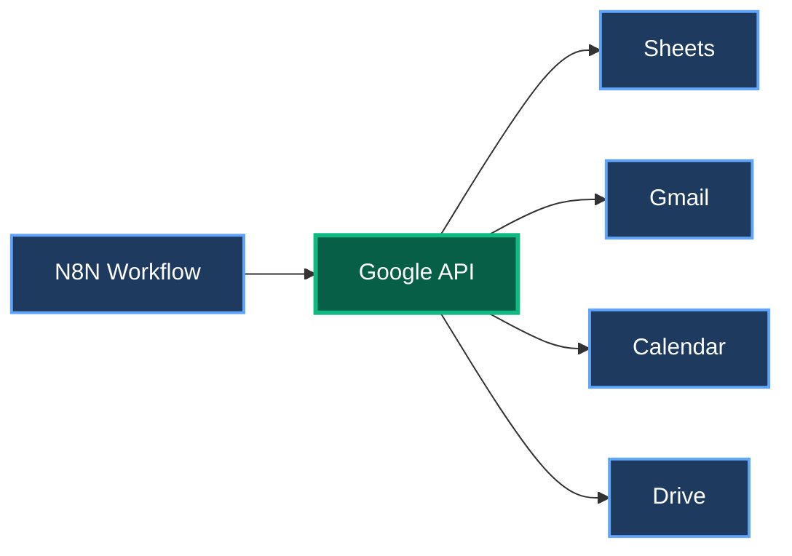
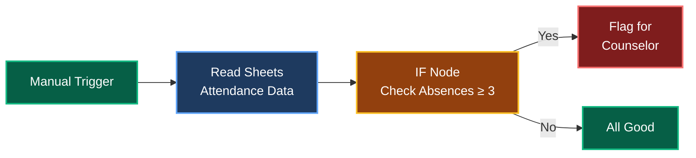

# Topic 2: Google Workspace Integration <mdi-google />

60 minutes • Connect Google • Work with Sheets • Real automation

---
transition: fade-out
---

# Why Google Workspace? <mdi-cloud />

Most schools already use Google - let's connect it to N8N!

<mdi-file-table />

Google Sheets

Student data, attendance, schedules

<mdi-email />

Gmail

Send automated emails

<mdi-google-drive />

Google Drive

Documents, forms, files

<mdi-lightbulb /> <strong>Goal:</strong> Make your existing Google tools work smarter, automatically

---
transition: slide-up
---

# Google API Integration <mdi-api />

<mdi-information /> <strong>One-time setup:</strong> Connect your Google account to N8N, then use it in all workflows

---
transition: fade-out
---

# Setting Up Google Credentials <mdi-key />

<mdi-numeric-1-circle class="text-3xl text-blue-500" />

In N8N: Go to Credentials

Settings → Credentials → Create New

<mdi-numeric-2-circle class="text-3xl text-green-500" />

Select "Google"

Choose the Google service (Sheets, Gmail, etc.)

<mdi-numeric-3-circle class="text-3xl text-purple-500" />

Authenticate

Login with your Google Workspace account

<mdi-numeric-4-circle class="text-3xl text-orange-500" />

Grant Permissions

Allow N8N to access your Google data

---
transition: slide-left
---

# Credentials Walkthrough <mdi-account-key />

<mdi-shield-check />

Secure Connection

OAuth 2.0 - Industry standard security

<mdi-cached />

Reusable

Set up once, use in all workflows

<mdi-account-multiple />

Scoped Access

Only access what you permit

<mdi-cancel />

Revocable

Remove access anytime in Google settings

<mdi-laptop /> <strong>Live Demo:</strong> Follow along as we connect Google

---
transition: fade-out
layout: center
class: text-center
---

<mdi-coffee />

# Break Time

5 minutes

---
transition: slide-up
layout: center
---

# <mdi-flask /> Hands-on Lab 2

Read & Write with Google Sheets

25 minutes • Real school data • Automated monitoring

---
transition: fade-out
---

# Lab 2: Student Absence Monitoring <mdi-account-alert />

Check attendance sheet daily and flag students with 3+ consecutive absences

<mdi-lightbulb /> <strong>Real Impact:</strong> Early intervention for at-risk students, automated daily checks

---
transition: slide-left
---

# Prepare Google Sheet <mdi-file-table />

Sample Sheet Structure:

| Student Name | Grade | Consecutive Absences | Last Absence Date |
|-------------|-------|---------------------|------------------|
| John Doe    | 9     | 4                   | 2024-11-03      |
| Jane Smith  | 10    | 1                   | 2024-11-02      |
| Bob Lee     | 9     | 5                   | 2024-11-03      |

<mdi-link class="text-2xl text-green-500" />

Instructor will share a prepared Google Sheet

<mdi-content-copy class="text-2xl text-blue-500" />

Copy the Sheet ID from the URL

---
transition: fade-out
---

# Step 1: Add Google Sheets Node <mdi-numeric-1-circle />

<mdi-plus class="text-3xl text-green-500" />

Add "Google Sheets" node

After your Manual Trigger

<mdi-cog class="text-3xl text-blue-500" />

Configure Operation

Select "Read" → "Get All Rows"

<mdi-key class="text-3xl text-purple-500" />

Select Credential

Use the Google credential we just created

<mdi-link class="text-3xl text-orange-500" />

Paste Sheet ID

From the shared Google Sheet URL

---
transition: slide-up
---

# Step 2: Test the Connection <mdi-numeric-2-circle />

<mdi-play-circle class="text-4xl text-green-500" />

Execute Node

Click "Execute Node" to test

You should see:

• All rows from your Google Sheet

• Student names, grades, absence data

• Data formatted as JSON

<mdi-check-circle /> <strong>Success!</strong> N8N can now read your Google Sheets

---
transition: fade-out
---

# Step 3: Add IF Node for Filtering <mdi-numeric-3-circle />

<mdi-call-split class="text-3xl text-orange-500" />

Add "IF" node after Google Sheets

Filter students based on absences

Set Condition:

<code class="block mb-2">Field: consecutiveAbsences</code>
<code class="block mb-2">Operation: Greater Than or Equal</code>
<code class="block">Value: 3</code>

<mdi-alert class="text-2xl" /> <strong>True Path:</strong> 3+ absences → Flag

<mdi-check class="text-2xl" /> <strong>False Path:</strong> Less than 3 → OK

---
transition: slide-left
---

# Step 4: View Filtered Results <mdi-numeric-4-circle />

<mdi-play-circle class="text-4xl text-green-500" />

Execute Full Workflow

Run from the start

<mdi-eye class="text-4xl text-blue-500" />

Check Both Paths

See which students got flagged

<mdi-chart-bar /> Expected Results:

• Students with ≥3 absences on True path

• Others on False path

• Count how many students need follow-up

---
transition: fade-out
---

# What's Next? <mdi-arrow-right />

<mdi-lightbulb /> In a Real Workflow, You Could:

<mdi-email class="text-green-500" /> Send email to counselor with flagged students

<mdi-file-document class="text-blue-500" /> Create a report in Google Docs

<mdi-calendar class="text-purple-500" /> Schedule automatic daily checks

<mdi-google-drive class="text-orange-500" /> Save results to another Sheet

<mdi-rocket /> We'll build complete workflows in the next topics!

---
transition: slide-up
---

# Practice Challenge <mdi-trophy />

<mdi-pencil /> Try This:

<mdi-checkbox-marked-circle class="text-green-500" /> Change the threshold to 5 absences

<mdi-checkbox-marked-circle class="text-green-500" /> Add another condition: Grade = 9 only

<mdi-checkbox-marked-circle class="text-green-500" /> What if you want to check for "Last Absence Date" being recent?

<mdi-timer-outline /> Time remaining: Check with instructor

---
transition: fade-out
layout: center
class: text-center
---

# Q&A <mdi-comment-question />

5 minutes • Questions about Google integration?

<mdi-google class="text-3xl mb-2" />

Google setup issues?

<mdi-file-table class="text-3xl mb-2" />

Sheets questions?

<mdi-flask class="text-3xl mb-2" />

Lab challenges?

