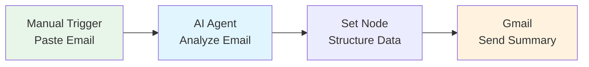

# Topic 3: AI Agent Integration <mdi-brain />

60 minutes • Smart automation • AI-powered workflows • Real magic

---
transition: fade-out
---

# What Are AI Agents? <mdi-robot-happy />

Think of them as smart assistants inside your workflows

<mdi-message-text />

Understand Context

Read emails, documents, data

Extract meaning, not just keywords

<mdi-pencil />

Generate Content

Write emails, summaries, reports

Professional and contextual

<mdi-lightbulb-on />

Make Decisions

Classify, categorize, prioritize

Understand nuance and tone

<mdi-code-braces-box />

No Coding!

Just write instructions in plain language

Like talking to a smart colleague

---
transition: slide-up
---

# Traditional vs AI <mdi-compare />

<mdi-cog /> Traditional IF Node

Exact Matching

<code class="text-sm">subject contains "urgent"</code>

Misses: "ASAP", "emergency", "critical"

Multiple Rules

Need to think of ALL variations

Rigid

Can't handle unexpected formats

<mdi-brain /> AI Agent

Understands Context

<code class="text-sm">"Is this urgent?"</code>

Catches all urgency signals

One Simple Prompt

"Classify email urgency level"

Flexible

Handles variations automatically

---
transition: fade-out
---

# When to Use AI Agents <mdi-thought-bubble />

<mdi-check-circle class="text-green-500" />

✓ Great For:

<mdi-email /> Summarizing emails or documents

<mdi-tag /> Categorizing unstructured content

<mdi-pencil /> Drafting responses or reports

<mdi-brain /> Extracting information from text

<mdi-translate /> Translating or rewording

<mdi-clipboard-check /> Analyzing sentiment/tone

<mdi-close-circle class="text-red-500" />

✗ Not For:

<mdi-calculator /> Simple math calculations

<mdi-compare /> Exact string matching

<mdi-database /> Database lookups

<mdi-clock /> Time/date operations

<mdi-format-list-numbered /> Counting items

<mdi-currency-usd /> Financial calculations

<mdi-lightbulb /> <strong>Rule of thumb:</strong> If it requires understanding context or generating human-like text → Use AI. If it's precise logic → Use traditional nodes.

---
transition: slide-left
---

# School Examples for AI <mdi-school />

<mdi-email-fast class="text-2xl" />
Auto-Summarize Parent Emails

Long email → 3 bullet points: concern, urgency, department

<mdi-file-document-edit class="text-2xl" />
Draft Responses

Parent question → Professional reply template, ready to review

<mdi-tag-multiple class="text-2xl" />
Categorize Feedback

Survey responses → Group by themes (teaching, facilities, communication)

<mdi-clipboard-text class="text-2xl" />
Extract Information

Casual meeting request → Structured data (date, time, attendees)

---
transition: fade-out
layout: center
class: text-center
---

<mdi-coffee />

# Break Time

5 minutes

---
transition: slide-up
layout: center
---

# <mdi-flask /> Hands-on Lab 4

Your First AI Agent Workflow

30 minutes • Smart Email Responder • Real AI power

---
transition: fade-out
---

# Lab 4: Smart Email Responder <mdi-email-fast />

AI reads parent email, summarizes it, identifies urgency & department

<mdi-sparkles /> <strong>Why This is Powerful:</strong> AI reads the context and meaning, not just keywords. Handles any writing style!

---
transition: slide-left
---

# Step 1: Setup Manual Trigger <mdi-numeric-1-circle />

<mdi-plus class="text-3xl text-green-500" />

Add "Manual Trigger" node

Start of our workflow

<mdi-cog class="text-3xl text-blue-500" />

Add a "Set" node

To input sample email text

Sample Email to Test:

"Hi, this is Sarah's mom. I'm really worried because she came home crying today. Some kids in her class have been excluding her from games during recess for the past week. Can we schedule a meeting to discuss this? I'm free Tuesday or Thursday afternoon. This is quite urgent as it's affecting her emotionally."

---
transition: fade-out
---

# Step 2: Add AI Agent Node <mdi-numeric-2-circle />

<mdi-brain class="text-3xl text-blue-500" />

Add "AI Agent" node

This is where the magic happens!

<mdi-key class="text-3xl text-purple-500" />

Select AI Credential

OpenAI, Claude, or other AI provider

Write Your Prompt:

"Summarize this parent email in 2-3 bullet points. Identify: 
1. Main concern 
2. Urgency level (low/medium/high) 
3. Suggested department to handle (Principal/Teacher/Counselor/Admin)"

---
transition: slide-up
---

# Understanding Prompts <mdi-message-text />

<mdi-close-circle /> Vague Prompt

<code class="text-xs">"Analyze this email"</code>

Too general, unpredictable results

<mdi-check-circle /> Clear Prompt

<code class="text-xs">"Identify: concern, urgency, department"</code>

Specific, structured output

<mdi-close-circle /> No Format

<code class="text-xs">"What's this about?"</code>

Free-form response, hard to process

<mdi-check-circle /> Structured Format

<code class="text-xs">"Provide as bullet points"</code>

Easy to parse and use

<mdi-lightbulb /> <strong>Tip:</strong> Be specific about WHAT you want and HOW you want it formatted

---
transition: fade-out
---

# Step 3: Structure the Output <mdi-numeric-3-circle />

<mdi-database class="text-3xl text-green-500" />

Add "Set" node after AI

Extract AI's response into structured fields

Create Fields:

<code class="block">summary: [AI response]</code>
<code class="block">urgency: [Extract urgency level]</code>
<code class="block">department: [Extract department]</code>
<code class="block">originalEmail: [Input email]</code>

<mdi-information /> <strong>Why?</strong> Structured data is easier to use in next steps (email, sheets, etc.)

---
transition: slide-left
---

# Step 4: Send Summary via Gmail <mdi-numeric-4-circle />

<mdi-email class="text-3xl text-orange-500" />

Add "Gmail" node

Send the AI summary to staff

<mdi-cog class="text-3xl text-blue-500" />

Configure Email

To: counselor@school.com

Subject: "Parent Email - [urgency] priority"

Email Body Template:

<code>AI Summary: [summary]</code> 
<code>Urgency: [urgency]</code> 
<code>Recommended: [department]</code> 
<code>--- Original Email ---</code> 
<code>[originalEmail]</code>

---
transition: fade-out
---

# Step 5: Test with Different Emails <mdi-numeric-5-circle />

<mdi-email /> Test Email 1: Urgent Issue

"My child reported bullying today..."

Expected: High urgency, Counselor

<mdi-email /> Test Email 2: Academic

"Can you explain the homework policy?"

Expected: Low urgency, Teacher

<mdi-email /> Test Email 3: Meeting Request

"Would like to discuss my child's progress..."

Expected: Medium urgency, Teacher

<mdi-magic-staff /> Watch how AI understands different tones and contexts!

---
transition: slide-up
---

# What Just Happened? <mdi-thought-bubble />

<mdi-brain />

AI Understood Context

• Recognized "crying" = emotional issue

• "Excluding her" = social/bullying

• "Quite urgent" = high priority

• Meeting request = counselor appropriate

<mdi-robot />

No Complex Rules Needed!

• No keyword lists

• No multiple IF conditions

• Just one clear prompt

• Adapts to any writing style

<mdi-sparkles class="text-2xl" /> <strong>This is the power of AI in workflows!</strong>

---
transition: fade-out
---

# Practice Challenge <mdi-trophy />

<mdi-pencil /> Try This:

<mdi-checkbox-marked-circle class="text-green-500" /> Modify prompt to also extract "parent contact preference" (email/phone/meeting)

<mdi-checkbox-marked-circle class="text-green-500" /> Add suggested response time (within 24hrs, 3 days, 1 week)

<mdi-checkbox-marked-circle class="text-green-500" /> Test with emails in different tones (angry, polite, confused)

<mdi-timer-outline /> Time remaining: Check with instructor

---
transition: slide-left
layout: center
class: text-center
---

# Q&A <mdi-comment-question />

10 minutes • Questions about AI agents?

<mdi-brain class="text-3xl mb-2" />

How AI agents work?

<mdi-message-text class="text-3xl mb-2" />

Writing better prompts?

<mdi-flask class="text-3xl mb-2" />

Lab questions?

