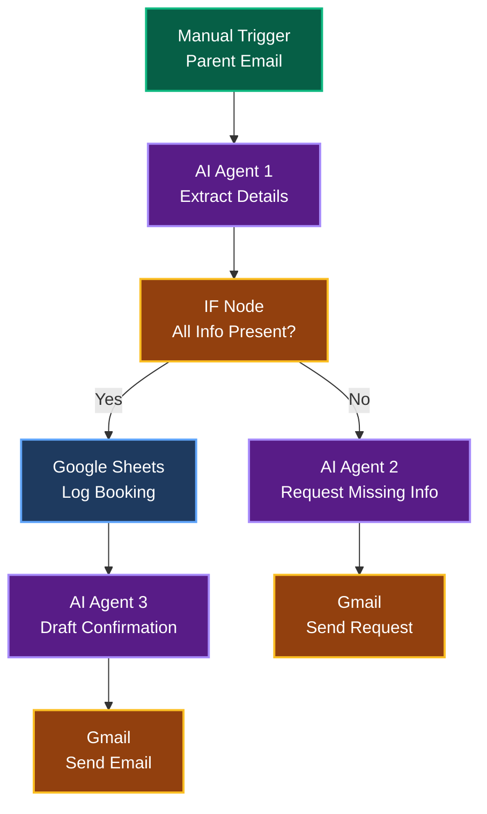

# Topic 4: Complete Workflow <mdi-rocket />

60 minutes • Putting it all together • Advanced AI workflow

---
transition: fade-out
layout: center
---

# <mdi-flask /> Hands-on Lab 5

Intelligent Parent-Teacher Conference Scheduler

30 minutes • AI + Google + Gmail • Real-world complexity

---
transition: slide-up
---

# Lab 5 Overview <mdi-calendar-check />

Complete automation: Parent emails → AI extracts details → Books meeting → Sends confirmation

---
transition: fade-out
---

# Sample Parent Emails <mdi-email />

<mdi-check-circle /> Complete Request

"Hi! I'm John's mom, Sarah Martinez. He's in 9th grade. I'd like to meet with his teacher Ms. Johnson next Tuesday or Wednesday afternoon to discuss his math progress. Thanks!"

Has: parent, student, grade, dates, reason

<mdi-alert /> Incomplete Request

"Hello, I'd like to schedule a meeting about my daughter's behavior. Can we meet sometime next week?"

Missing: parent name, student name, grade, specific dates

---
transition: slide-left
---

# Step 1: Setup & First AI Agent <mdi-numeric-1-circle />

<mdi-gesture-tap class="text-3xl text-green-500" />

Manual Trigger + Set Node

Paste the sample "complete request" email

<mdi-brain class="text-3xl text-blue-500" />

Add AI Agent Node

Extract structured booking information

AI Agent Prompt:

"Extract from this email: 
- Parent name 
- Student name 
- Grade 
- Preferred dates/times 
- Reason for meeting 
 
If any information is missing, list what's needed."

---
transition: fade-out
---

# Step 2: Decision Logic <mdi-numeric-2-circle />

<mdi-call-split class="text-3xl text-orange-500" />

Add IF Node

Check if all required info is present

<mdi-check-circle />

Path A: Complete Info

→ Log to Google Sheets

→ Draft confirmation email

→ Send confirmation

<mdi-alert />

Path B: Missing Info

→ AI drafts reply

→ Request missing details

→ Send request email

<mdi-lightbulb /> <strong>Smart routing:</strong> Workflow adapts based on input quality

---
transition: slide-up
---

# Step 3: Path A - Complete Info <mdi-numeric-3-circle />

<mdi-arrow-right /> When all info is present:

<mdi-file-table class="text-3xl text-green-500" />

Google Sheets Node: Log Booking

Add row with: parent, student, grade, date, reason, status

<mdi-brain class="text-3xl text-blue-500" />

AI Agent Node: Draft Confirmation

Generate professional confirmation email

Confirmation Email Prompt:

"Write a friendly confirmation email including: 
- Confirmed date and time 
- Teacher name: Ms. Johnson 
- Location: Room 305 
- What to bring: Student progress report 
- Contact info if they need to reschedule"

---
transition: fade-out
---

# Step 4: Send Confirmation <mdi-numeric-4-circle />

<mdi-email class="text-3xl text-orange-500" />

Gmail Node: Send Confirmation

Deliver the AI-generated email

Email Configuration:

<code class="block">To: [parent email]</code>
<code class="block">Subject: "Conference Confirmed - [student name]"</code>
<code class="block">Body: [AI-generated confirmation email]</code>

<mdi-check-circle /> <strong>Result:</strong> Parent receives professional confirmation automatically!

---
transition: slide-left
---

# Step 5: Path B - Missing Info <mdi-numeric-5-circle />

<mdi-arrow-right /> When info is incomplete:

<mdi-brain class="text-3xl text-purple-500" />

AI Agent Node: Request Details

Generate friendly request for missing info

Request Email Prompt:

"Write a polite email requesting these missing details: 
[List of missing info from AI Agent 1] 
 
Be friendly and helpful. Explain we need this to schedule the meeting."

<mdi-email class="text-3xl text-orange-500" />

Gmail Node: Send Request

Ask parent for more details

---
transition: fade-out
---

# Step 6: Test Both Scenarios <mdi-test-tube />

<mdi-numeric-1-circle /> Test 1: Complete Request

Use the complete email → Should log to Sheets and send confirmation

<mdi-numeric-2-circle /> Test 2: Incomplete Request

Use the incomplete email → Should request missing details

<mdi-numeric-3-circle /> Test 3: Your Own Email

Write a casual meeting request → See how AI handles it

<mdi-sparkles /> Watch the workflow make intelligent decisions!

---
transition: slide-up
---

# What Makes This Powerful? <mdi-lightning-bolt />

<mdi-brain />

AI Flexibility

• Handles any email format

• Understands casual language

• Extracts structured data

• Generates professional responses

<mdi-account-check />

Smart Logic

• Validates completeness

• Routes intelligently

• Handles errors gracefully

• Maintains context

<mdi-google />

Integration Power

• Logs to Google Sheets

• Sends via Gmail

• All automated

• No manual work

<mdi-clock-fast />

Time Savings

• Instant processing

• Consistent quality

• No missed details

• 24/7 availability

---
transition: fade-out
layout: center
class: text-center
---

<mdi-coffee />

# Break Time

5 minutes

---
transition: slide-left
---

# AI Agent Best Practices <mdi-star />

Tips for writing effective AI prompts

---
transition: fade-out
---

# 1. Be Specific <mdi-bullseye />

<mdi-close-circle class="text-red-500" />

❌ Vague

<code class="text-sm">"Analyze this email"</code>

Too open-ended, unpredictable results

<mdi-check-circle class="text-green-500" />

✓ Specific

<code class="text-sm">"Extract: name, date, reason"</code>

Clear expectations, consistent output

<mdi-close-circle class="text-red-500" />

❌ General

<code class="text-sm">"Make it sound good"</code>

Subjective, inconsistent

<mdi-check-circle class="text-green-500" />

✓ Clear

<code class="text-sm">"Write in friendly, professional tone"</code>

Defined style, predictable

---
transition: slide-up
---

# 2. Provide Format Examples <mdi-format-list-bulleted />

<mdi-lightbulb /> Better Prompts Include Format:

"Respond in this format: 
- Summary: [2-3 sentences] 
- Urgency: [low/medium/high] 
- Department: [specific department name]"

<mdi-check-circle /> Why This Helps:

• Easier to parse in next nodes

• Consistent structure every time

• Reduced errors in data extraction

• Predictable workflow behavior

---
transition: fade-out
---

# 3. When to Use AI vs Traditional Nodes <mdi-scale-balance />

<mdi-brain /> Use AI When:

<mdi-text /> <strong>Unstructured data</strong> 
Emails, documents, free text

<mdi-file-document-edit /> <strong>Content generation</strong> 
Writing emails, summaries

<mdi-message-text /> <strong>Context understanding</strong> 
Tone, intent, sentiment

<mdi-lightbulb-variant /> <strong>Classification</strong> 
Categorizing by meaning

<mdi-cog /> Use Traditional Nodes When:

<mdi-calculator /> <strong>Math operations</strong> 
Calculations, formulas

<mdi-compare /> <strong>Exact matching</strong> 
Known strings, IDs

<mdi-clock /> <strong>Date/time logic</strong> 
Scheduling, timestamps

<mdi-database /> <strong>Data operations</strong> 
Filtering, sorting, lookups

---
transition: slide-left
---

# 4. Cost Considerations <mdi-currency-usd />

<mdi-alert class="text-3xl" />
AI Calls Cost Money

Each AI Agent node uses API tokens (usually cents per call)

<mdi-close-circle /> Expensive Pattern

Using AI for every small task

Example: AI to check if number > 5

<mdi-check-circle /> Cost-Effective Pattern

AI for complex understanding only

Example: AI to understand email intent

<mdi-lightbulb /> <strong>Tip:</strong> Use AI where it adds real value, use traditional nodes for simple logic

---
transition: fade-out
---

# 5. Testing & Iteration <mdi-sync />

<mdi-numeric-1-circle class="text-2xl" />
Test with diverse inputs

Different email styles, tones, completeness

<mdi-numeric-2-circle class="text-2xl" />
Check edge cases

Missing data, unclear requests, multiple issues in one email

<mdi-numeric-3-circle class="text-2xl" />
Refine your prompts

Add examples, clarify expectations based on results

<mdi-numeric-4-circle class="text-2xl" />
Monitor over time

Review actual workflow results, adjust as needed

---
transition: slide-up
---

# Real-World Tips <mdi-bookmark-check />

<mdi-human-greeting /> <strong>Always review AI output initially</strong>

Don't go fully automated until you've tested thoroughly

<mdi-content-save /> <strong>Save successful prompts</strong>

Document what works for future workflows

<mdi-account-multiple /> <strong>Get feedback from end users</strong>

Are the emails professional? Is categorization accurate?

<mdi-update /> <strong>Update prompts as needs change</strong>

School processes evolve, so should your workflows

---
transition: fade-out
---

# Practice Challenge <mdi-trophy />

<mdi-pencil /> Advanced Challenge:

<mdi-checkbox-marked-circle class="text-green-500" /> Add a third AI agent to detect if email is urgent (bypass normal booking)

<mdi-checkbox-marked-circle class="text-green-500" /> Modify to check teacher availability in a "Teachers Schedule" sheet

<mdi-checkbox-marked-circle class="text-green-500" /> Add calendar invite generation for confirmed bookings

<mdi-timer-outline /> Time remaining: Check with instructor

---
transition: slide-left
layout: center
class: text-center
---

# Final Q&A <mdi-comment-question />

10 minutes • Any questions about the full session?

<mdi-robot class="text-3xl mb-2" />

N8N basics?

<mdi-google class="text-3xl mb-2" />

Google integration?

<mdi-brain class="text-3xl mb-2" />

AI agents?

<mdi-rocket class="text-3xl mb-2" />

Next steps?

---
transition: fade-out
layout: center
---

# What You've Learned Today <mdi-school />

<mdi-puzzle />

N8N Fundamentals

Workflows, nodes, triggers, testing

<mdi-google />

Google Integration

Sheets, Gmail, credentials, automation

<mdi-brain />

AI Agents

Smart understanding, prompts, content generation

<mdi-rocket />

Complete Workflows

Multi-step automation, intelligent routing

---
transition: slide-up
layout: center
---

# Next Steps <mdi-map-marker-path />

<mdi-flask class="text-3xl" />
Practice

Build workflows for YOUR school's actual needs

<mdi-account-group class="text-3xl" />
Share

Show colleagues, gather more automation ideas

<mdi-book-open class="text-3xl" />
Explore

N8N has 400+ integrations - what else can you connect?

---
transition: fade-out
layout: center
class: text-center
---

# You're Now Automation Heroes! <mdi-trophy />

Thank you for your attention and enthusiasm

Happy automating! 🚀

